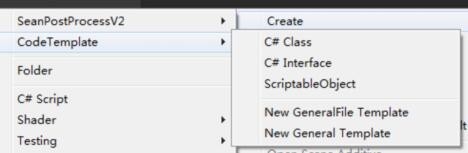

# CodeTemplate/BuiltinTemplate

## CSTemplate

普通的C#类型

## SeanLibTemplate

Seanlib 相关编辑器和文档

## UnityTemplate

### CustomEditor 

自定义Inspector编辑器

### package

packageManger需要的 packageInfo 文件。

### ScriptableObject

可序列化脚本资源。