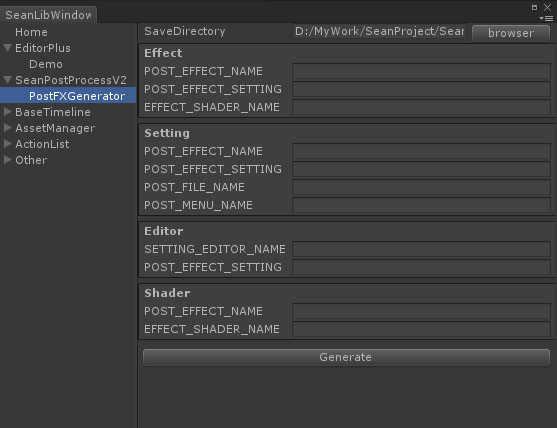

# CodeTemplate <color="orange">(Preview)</color>
## 以模板的方式生成代码和文件
### 在模板中定义特殊关键字，最后替换完成。 

>Version

## ITemplate 

模板接口。

## TemplateAsset

使用UnityScriptableObject 保存模板配置。
模板资源文件。继承它并实现复杂的模板功能。

### FileTemplateAsset

TemplateAsset基础上 增加文件生成功能。

### 1.	TemplateName 

模板名称，没有实际作用只是用来标记模板对象。

### 2.	FilePath 

文件路径，包含文件扩展名。

### 3.	Template 

模板本体

### 4.	KeyWords 

模板中关键字列表

## CodeGenerator 

代码生成器基类。
1.	继承并在Base.OnEnable()之前，写入模板子类。生成器会自行枚举所有关键字。
2.	填写所有关键字。
3.	点击Generate生成文件。

### 自行扩展 

目前已有的扩展：
BaseTimeLine Generator
SeanPostProcessV2 PostFX Generator

## 内置模板

内建了几个常用的模板。例如生成 普通c#类 

>BuiltinTemplate